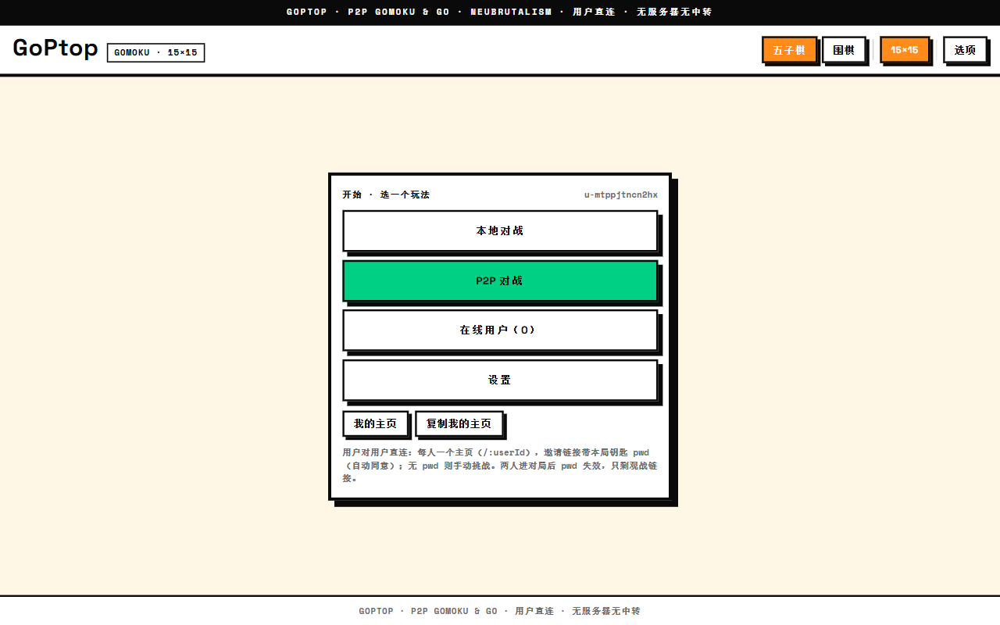
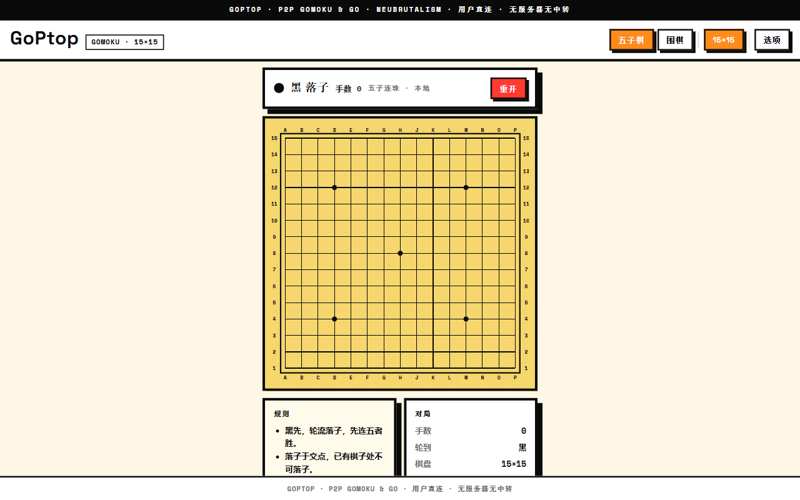
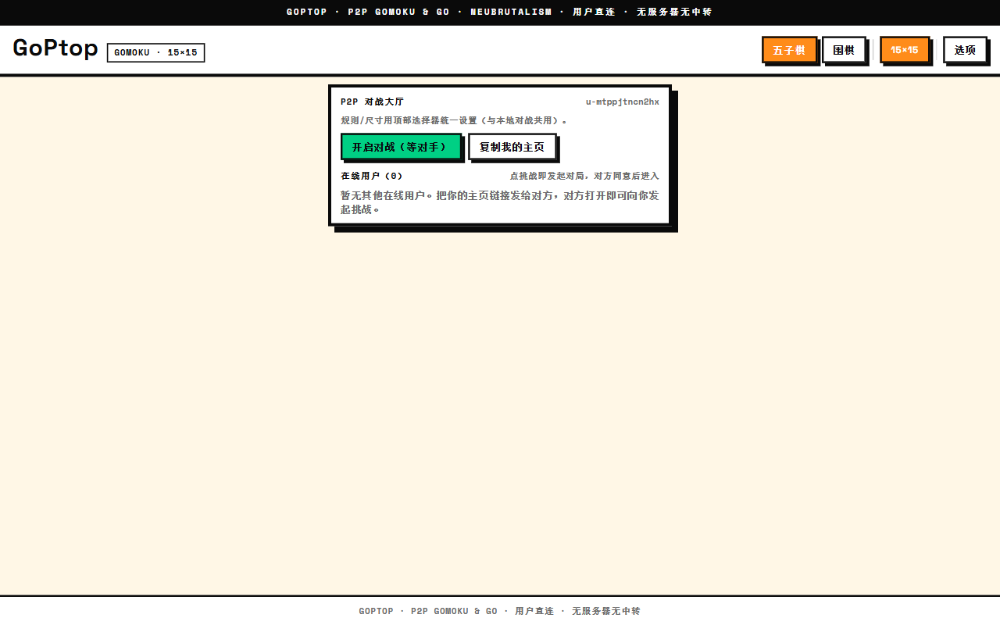

# GoPtop — 以无厚入有间 · P2P 围棋 · 五子棋

> 「道生一，一生二，二生三，三生万物。」——《道德经 · 四十二章》
>
> 一局棋，生于两位对弈者；黑白二子，衍三百六十一路之万物。
> GoPtop 取「道法自然」之意：**以无形之通道直达彼岸**——棋枰之上，对弈之信息优先 P2P 直达，恰如庖丁解牛「以无厚入有间」，不着一物，而游刃有余。信令服务器是可选的问路石，不连亦可对弈。
>
> 「大音希声，大象无形。」——最好的服务器，就是没有服务器。

硬核新野兽派画风（Neubrutalism）· Tauri + React + TypeScript · **规则引擎 Rust 唯一真源**（core 经 wasm 在 Web 与桌面 WebView 执行同一份判定）· 优先 P2P 直连（同源 BroadcastChannel / 跨设备 WebRTC DataChannel，STUN 穿透，无 TURN）· 信令服务器可选（在线名册 + 点对点信令转发 + 数据兜底中转，纯转发不落地，不连服务器则完全无设施）。

---

## 一 · 见棋 —— 功能览要

> 「不出户，知天下；不窥牖，见天道。」——《道德经 · 四十七章》
>
> 足不出户，一条链接即达棋枰之前：邀者发链，应者开链，棋盘自现，落子便战。

| 玩法 | 说明 |
|---|---|
| 本地对战 `/local` | 同屏双打，与 P2P 同一套棋盘 UI（唯无邀请链接）。黑先轮流落子，悔棋、重开一应俱全 |
| 人机对战 `/ai` | 本地离线 AI 对手：五子棋走 α-β + NNUE（Gomocup 参赛引擎），围棋走 MCTS + RAVE。三档难度、可换先后手；引擎在 Web Worker 里跑，界面全程不冻结 |
| P2P 对战 `/p2p` | 生成邀请链接（`/<邀请者ID>?pwd=…&kind=…&size=…`），发给对方即开局；邀请者凭钥匙 `pwd` 自动应战，两人进局后钥匙自废，余者只剩观战。连上服务器时链接跨设备免回执，不连时跨设备走「回执」粘贴（全部能力本地可用） |
| 在线用户 `/users` | 同源自动发现：谁空闲、谁待战、谁战中，一目了然；可手动挑战，亦可复制主页相邀 |
| 观战 `/watch/<gameId>` 或 `/<ID>?pwd=<观战钥匙>&spec=1` | 观棋不语真君子——实时同步落子，只看不下；服务器模式下跨设备可用（每局一把观战钥匙，可批准申请、禁言、踢人） |
| 设置 `/settings` | 穿透节点（STUN）九条内置自择、可自添；信令服务器单选（官方服务器 / 自建 / 无服务器） |

**实时胜率**：所有对局模式（含观战）的底部都可切到「胜率」——一条红蓝单挑线（红＝我方、蓝＝对手，实时移动）配一张随手数变化的走势图。局面由 Rust 引擎序列化后交给离线分析，全程本机计算、不经网络。

规则：五子棋 15×15（四向连五即胜）；围棋 9 / 13 / 19（落子、**提子、禁自杀**已由 Rust 规则引擎执行；劫争与终局数目在路线图，见 `docs/已知限制与路线图.md`）。棋盘视口自适应——「人法地，地法天」：屏大则棋大，屏小则棋小，整组等宽同步缩放，永不溢出。

> 更多文档：[`docs/使用指南.md`](docs/使用指南.md)（完整玩法与疑难解答） · [`docs/部署指南.md`](docs/部署指南.md)（Cloudflare Pages 等） · [`docs/已知限制与路线图.md`](docs/已知限制与路线图.md)（诚实清单）

### 选项页



### 本地对战（自适应棋盘）



### P2P 对战（邀请链接一键开局）



---

## 二 · 弈理 —— 为何无服务器亦能对弈

> 「道隐无名。」——《道德经 · 三十二章》
>
> 通道隐于无名，而棋迹显于有形。

```
  邀请者   ◄──── 邀请链接（含本局钥匙 pwd） ────► 受邀者
      │                                              │
      │   同源双页：BroadcastChannel 端到端直传        │
      │   跨设备：WebRTC DataChannel 点对点加密直传    │
      │   （STUN 只问路、不传棋：仅作 NAT 地址发现）    │
      ▼                                              ▼
   同一张棋盘 · 同一套规则 · 落子即同步 · 胜负即判晓
```

- **同浏览器 / 双窗口**：`BroadcastChannel` 同源直传，零配置秒连。
- **跨设备**：`RTCPeerConnection + DataChannel`，offer/answer 编进链接或经服务器信令自动交换；STUN 负责「问路」（NAT 地址发现），棋步优先走 P2P 加密通道；直连不通时，服务器模式可经服务器加密兜底中转（可选，不连服务器则宁断不转）。
- **钥匙机制**：每局一钥（`pwd`），邀请者自动认钥应战；两人进局钥匙即废——「功成而弗居」，后来者只可观战，不可乱入。观战另有一钥（`specPwd`），整局有效。
- **规则真源**：落子、五连、提子、禁自杀全部由 Rust core 判定（编译为 wasm 供 Web，Tauri 同一份）——TS 只画棋盘、传消息。

---

## 三 · 安位 —— 本地运行

> 「合抱之木，生于毫末；九层之台，起于累土。」——《道德经 · 六十四章》

```bash
# 1）取码
git clone <repo-url> && cd GoPtop

# 2）纯 Web 验证（无需 Rust/桌面壳）
npm --prefix frontend install
npm --prefix frontend run dev      # http://localhost:1420

# 3）构建产物
npm --prefix frontend run build    # 输出 frontend/dist，可直接静态托管

# 4）Tauri 桌面（需 Rust 工具链）
npm --prefix frontend install
npm --prefix frontend run tauri dev

# 5）自建信令服务器（可选；官服地址内置，无需自建也能用）
cargo run -p goptop-server -- --listen=127.0.0.1:9527
```

验收「双窗口对弈」：一窗 `/p2p` 点「复制邀请链接」，另一窗（或无痕窗）粘贴打开——两窗落子实时同步，即为功成。

---

## 四 · 登云 —— 部署于 Cloudflare Pages（首选）

> 「上善若水，水善利万物而不争，处众人之所恶，故几于道。」——《道德经 · 八章》
>
> 静态托管如水：不争后端之利，只载前端之形，处众服务器之所恶（贵、难运维），故几于道。Cloudflare Pages 免费、全球边缘、自带 HTTPS（WebRTC 跨设备直连**必须** HTTPS/localhost），正是此局棋盘初登云端的不二之选。

### 4.1 一键部署（推荐：连仓库自动部署）

1. 将本仓库推到 GitHub（或 GitLab）。
2. 打开 [Cloudflare Dashboard → Workers & Pages → Create → Pages → Connect to Git](https://dash.cloudflare.com/)，选中本仓库。
3. 构建设置如下（**一字不差**）：

| 项 | 值 |
|---|---|
| Framework preset | `Vite`（或 None，自填亦可） |
| Build command | `npm --prefix frontend install && npm --prefix frontend run build` |
| Build output directory | `frontend/dist` |
| Root directory | 留空（仓库根） |
| Environment variables | 无需任何变量 |

4. 点 Deploy。首建约一分钟，得形如 `goptop.pages.dev` 之域名。
5. 此后每次 `git push`，Cloudflare 自动重建——「为学日益，为道日损」：你只管落子（push），云自收官（build）。

### 4.2 SPA 路由回退（已备好，无需动手）

站内路由（`/local`、`/p2p`、`/users`、`/settings`、 `/<userId>`、`/watch/<id>`）皆为前端路由，直链打开/刷新时需回退到 `index.html`。本仓库已在 `frontend/public/_redirects` 备好：

```
/*    /index.html   200
```

构建时自动拷贝至 `frontend/dist/_redirects`，Cloudflare Pages 与 Netlify 皆认此式。**验证**：部署后直访 `https://<你的域名>/local`，应见棋盘而非 404；若见 404，检查构建日志中 `_redirects` 是否确在输出目录。

### 4.3 HTTPS 与 WebRTC

- Pages 默认全站 HTTPS，同源双页直传与跨设备 `WebRTC` 皆可施展；`localhost` 亦可（浏览器视为安全上下文）。
- 若绑自定义域名，Cloudflare 自动签发证书，无需另配。
- STUN 只作「问路」（UDP 打洞寻址），对称型 NAT 下或需各自所处网络放行 UDP；此乃 P2P 天性使然，非本局之过——「知人者智，自知者明」，连不上时先看设置页的节点开关与浏览器控制台。

### 4.4 预览与回滚

每次 PR 自动生成预览链接（`*.goptop.pages.dev` 的一支），正如试下一着散棋；正式环境（Production）与分支预览各自分明，误子可即时回滚到任意一次成功部署——「慎终如始，则无败事。」

### 4.5 备选落子：Netlify / Vercel / 任意静态托管

- **Netlify**：同 `_redirects` 即插即用；构建命令与输出目录同上。
- **Vercel**：需在项目设置加 `rewrites: [{ "source": "/(.*)", "destination": "/index.html" }]`（`_redirects` 为 Netlify/Cloudflare 方言，Vercel 不认）。
- **Nginx/自有服务器**：`try_files $uri /index.html;` 一句即可；须配 HTTPS 证书方可跨设备直连。

---

## 五 · 器用 —— 目录结构

> 「埏埴以为器，当其无，有器之用。」——《道德经 · 十一章》
>
> 器之用在其「无」：空处能容，方能运子。

- `crates/goptop-core` — 规则唯一真源（棋盘/五连/提子/禁自杀），编译为 WASM 供前端执行（`scripts/build-wasm.sh`）
- `crates/goptop-server` — 官方信令服务器（Rust/axum）：名册 + 信令转发 + 兜底中转，纯内存不落地
- `src-tauri` — Tauri 2 桌面壳（窗口；WebView 内与 Web 同一份前端与 wasm 规则）
- `frontend` — Vite + React + TS（`brutal.css` 新野兽派；`src/net/` P2P 门面，`src/state/` 对局状态机，`src/pages/` 页面）
- `docs/screenshots` — 本 README 所引截图
- `.agents/` — 贡献者 agent 共用记忆与开发文档（团队真经，人类读者可略过）

---

## 六 · 问路石 —— STUN 节点

> 「天之道，损有余而补不足。」——《道德经 · 七十七章》
>
> 官方通道拥挤时，自添节点以补不足。

| 名 | 地址 | 默认 |
|---|---|---|
| 小米 | `stun.miwifi.com:3478` | 开 |
| 哔哩哔哩 | `stun.chat.bilibili.com:3478` | 开 |
| Cloudflare | `stun.cloudflare.com:3478` | 开 |
| Google | `stun.l.google.com:19302` | 关 |
| Twilio / Nextcloud / Sipnet / Cope / wtfismyip | 见设置页 | 关 |
| 自定 | 设置页自添（任意 `stun:host:port`） | — |

STUN 只问路、不传棋；回合制每步不足 1KB，直连之后与节点再无瓜葛。

---

功成，棋罢。收子，复盘。「夫唯不争，故天下莫能与之争。」—— issues 与 PR，扫榻相迎。
